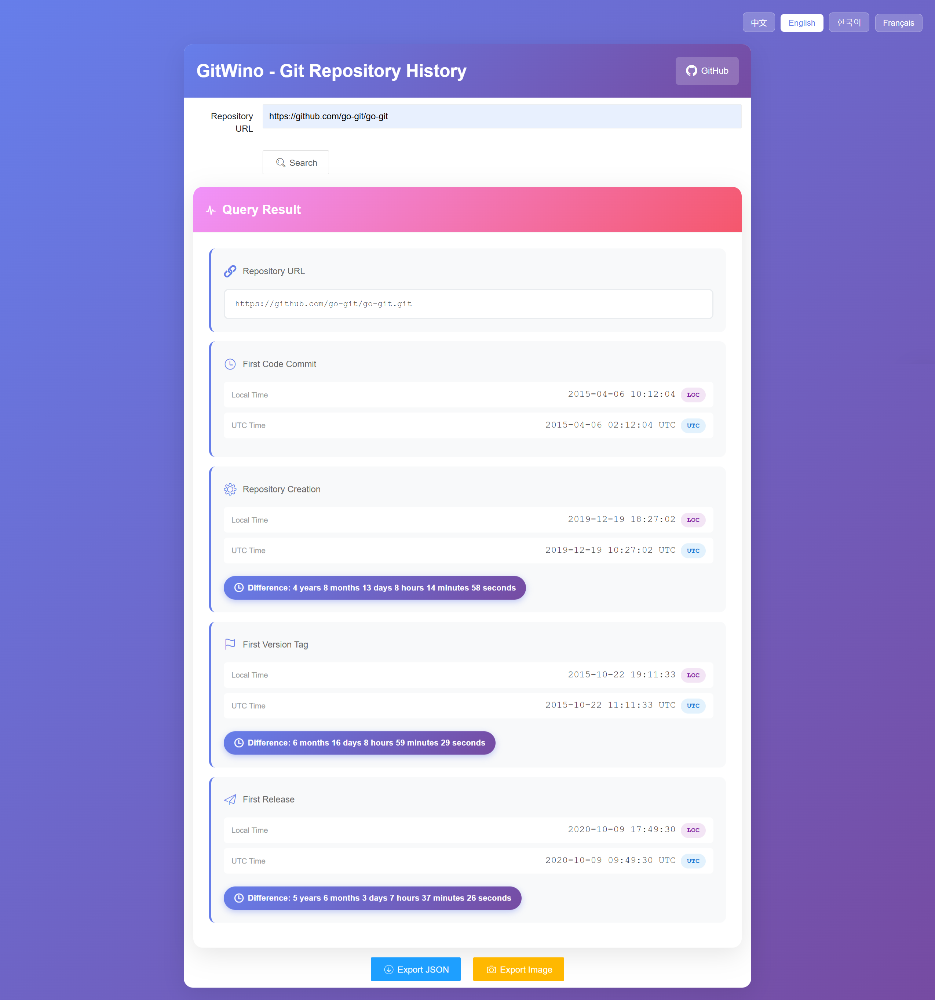

# GitWino



**语言:** [English](README.md) | [中文](README_zh.md)

GitWino 是一个功能强大的 Git 仓库历史查询工具，支持多平台 Git 仓库的时间线分析，可查询代码提交、仓库创建、版本标签和发布时间的详细信息。


## 功能特性

- **多平台支持**：支持 GitHub、Gitee（码云）和 GitLab
- **完整时间线**：查询以下关键时间节点：
  - 首次代码提交时间
  - 仓库创建时间
  - 首个版本标签时间
  - 首次发布时间
- **时区显示**：所有时间同时显示 UTC 和本地时间
- **时间差分析**：自动计算各事件之间的时间间隔
- **数据导出**：支持导出为 JSON 或图片格式
- **现代化界面**：渐变色界面设计，响应式布局
- **多语言支持**：支持中文、英文、韩语和法语

## 技术栈

### 后端
- **语言**：Go 1.25.0
- **Web 框架**：Gin
- **Git 库**：go-git/v5
- **部署**：支持 Vercel 无服务器部署

### 前端
- **UI 框架**：Layui
- **工具库**：html2canvas（用于图片导出）
- **CDN**：使用 BootCDN 加速资源加载

## 安装与运行

### 本地开发环境

1. **克隆项目**
```bash
git clone https://github.com/Maicarons/GitWino.git
cd gitwino
```

2. **安装依赖**
```bash
go mod download
```

3. **运行应用**
```bash
go run main.go
```

4. **访问应用**
打开浏览器访问 `http://localhost:8080`

### Vercel 部署

GitWino 支持在 Vercel 上进行无服务器部署：

1. 安装 Vercel CLI：
```bash
npm install -g vercel
```

2. 部署项目：
```bash
vercel
```

项目中已包含 `vercel.json` 配置文件。

## 使用说明

1. **输入仓库 URL**：输入 Git 仓库地址（支持 GitHub、Gitee 或 GitLab）
   - 示例：`https://github.com/owner/repo`
   - 示例：`https://gitee.com/owner/repo`
   - 示例：`https://gitlab.com/owner/repo`

2. **点击查询**：系统将自动执行以下操作：
   - 临时克隆仓库
   - 分析提交历史
   - 查询平台 API 获取创建和发布信息
   - 计算各事件之间的时间差

3. **查看结果**：查询结果包括：
   - 仓库地址
   - 首次提交时间（显示 UTC 和本地时间）
   - 仓库创建时间（显示与首次提交的时间差）
   - 首个标签时间（显示与首次提交的时间差）
   - 首次发布时间（显示与首次提交的时间差）

4. **导出数据**：
   - 点击"导出 JSON"下载 JSON 格式数据
   - 点击"导出图片"将结果保存为 PNG 图片

## API 接口

### 查询仓库历史

**接口**：`GET /api`

**参数**：
- `repo`（必填）：Git 仓库 URL

**响应示例**：
```json
{
  "earliest_commit_time": "2020-01-15T08:30:00Z",
  "repo_creation_time": "2020-01-10T12:00:00Z",
  "earliest_tag_time": "2020-02-01T10:00:00Z",
  "earliest_release_time": "2020-02-05T14:30:00Z",
  "repo_url": "https://github.com/owner/repo.git"
}
```

**错误响应**：
```json
{
  "error": "错误信息描述"
}
```

## 项目结构

```
gitwino/
├── api/                    # API 处理器
│   └── index.go           # HTTP 请求处理
├── frontend/              # 前端静态文件
│   ├── index.html        # 主页面
│   ├── app.js            # 应用逻辑
│   ├── style.css         # 样式文件
│   └── i18n.js           # 国际化配置
├── internal/git/          # Git 服务实现
│   ├── providers/        # 平台特定的提供者
│   │   ├── github.go     # GitHub API 集成
│   │   ├── gitee.go      # Gitee API 集成
│   │   ├── gitlab.go     # GitLab API 集成
│   │   └── provider_manager.go  # 提供者管理
│   ├── git.go           # Git 核心逻辑
│   ├── repository.go    # 仓库操作
│   └── types.go         # 数据结构定义
├── main.go              # 应用入口
├── go.mod               # Go 模块定义
├── go.sum               # 依赖校验文件
└── vercel.json          # Vercel 部署配置
```

## 支持的平台

- **GitHub**: 完整支持提交历史、仓库创建、标签和发布信息
- **Gitee（码云）**: 支持提交历史、仓库创建和发布信息
- **GitLab**: 完整支持提交历史、仓库创建、标签和发布信息
- **其他平台**: 有限支持提交历史

## 工作原理

1. **URL 解析**：系统从仓库 URL 识别 Git 平台
2. **仓库克隆**：使用 go-git 临时克隆仓库
3. **提交分析**：扫描所有分支找到最早提交
4. **标签分析**：按提交时间找到最早标签
5. **API 集成**：查询平台 API 获取仓库创建和发布时间
6. **数据处理**：计算时间差并格式化时间戳
7. **结果展示**：以 UTC 和本地时区展示数据

## 开发与构建

### 环境要求
- Go 1.25.0 或更高版本
- Node.js（可选，用于 Vercel CLI）

### 构建项目
```bash
go build -o gitwino main.go
```

### 运行测试
```bash
go test ./...
```

## 已知限制

- 私有仓库需要配置 API Token（尚未实现）
- 超大型仓库可能因克隆时间较长而分析较慢
- 部分平台 API 存在调用频率限制

## 未来规划

- 支持带认证的私有仓库访问
- 增加更多 Git 平台支持（如 Bitbucket 等）
- 添加历史统计图表功能
- 支持批量仓库分析
- 提供 API Token 配置界面

## 贡献指南

欢迎贡献！请随时提交 Pull Request。

1. Fork 本仓库
2. 创建特性分支 (`git checkout -b feature/AmazingFeature`)
3. 提交更改 (`git commit -m 'Add some AmazingFeature'`)
4. 推送到分支 (`git push origin feature/AmazingFeature`)
5. 提交 Pull Request

## 开源协议

本项目采用 Apache 2.0 开源协议。

## 致谢

- [Gin Web Framework](https://github.com/gin-gonic/gin)
- [go-git](https://github.com/go-git/go-git)
- [Layui](https://layui.dev/)
- [html2canvas](https://html2canvas.hertzen.com/)

## 联系方式

- **作者**：Maicarons
- **项目地址**：[https://github.com/Maicarons/GitWino](https://github.com/Maicarons/GitWino)

---

Made with ❤️ by Maicarons
